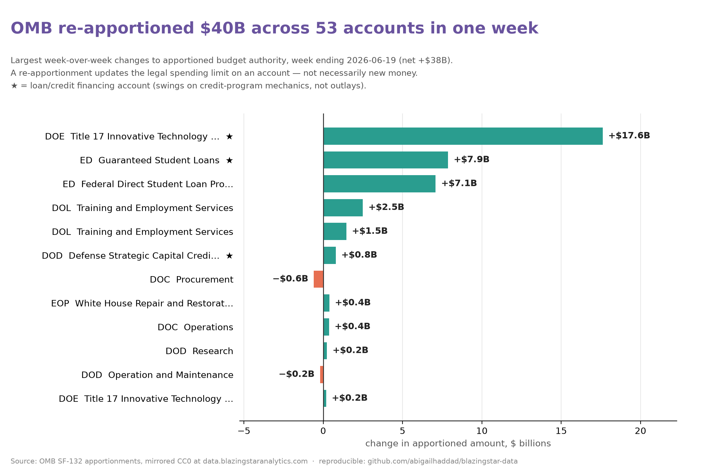
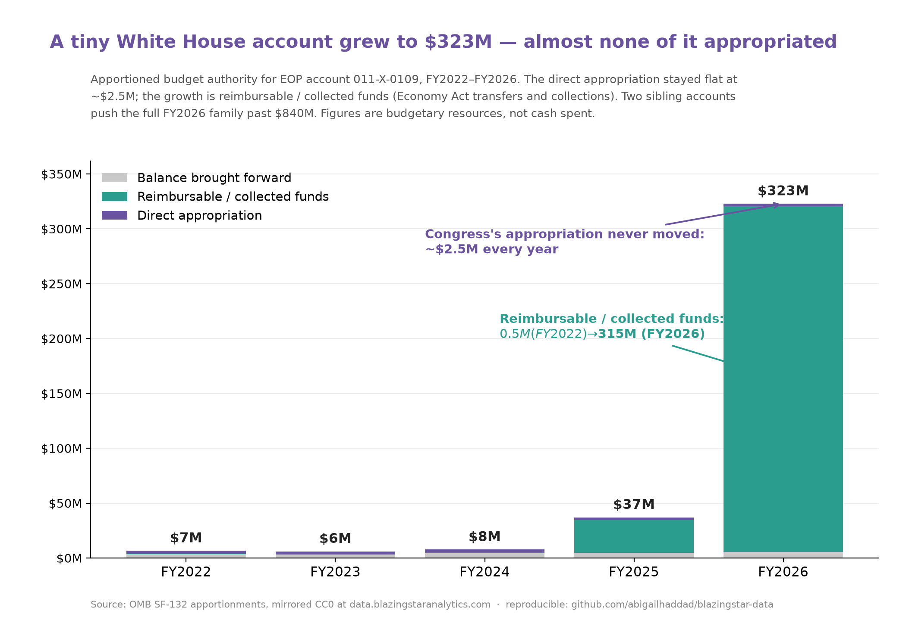
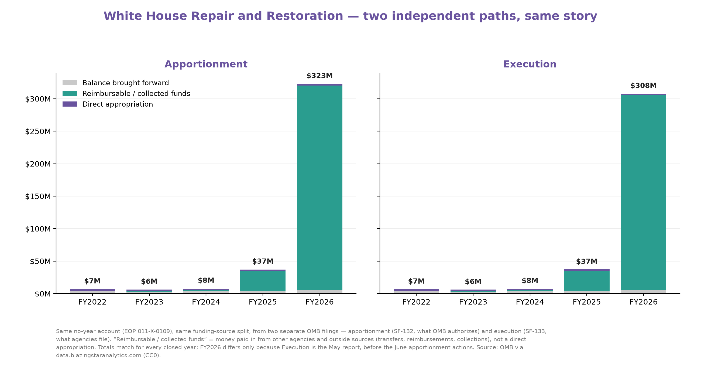

# blazingstar-data

A small, unofficial demo of how to pull the **free public federal-budget data**
that [BlazingStar Analytics](https://www.blazingstaranalytics.com/) mirrors at
**[data.blazingstaranalytics.com](https://data.blazingstaranalytics.com/)**.

Everything served there is a mirror of primary federal sources (OMB MAX.gov,
GovInfo/GPO, the Federal Register, Regulations.gov), released under
[**CC0 1.0**](https://creativecommons.org/publicdomain/zero/1.0/) (public
domain). There is **no API key and no login** — each dataset is a single
`index.json` you can fetch with `requests` and load straight into pandas. (One
gotcha: the CDN returns 403 to requests that send no `User-Agent`, so set one —
the notebook does.) Every record carries its `source_url` and a pull timestamp;
the execution files also carry a published SHA-256 so you can byte-verify them
against OMB.

> This repo is not affiliated with or endorsed by BlazingStar Analytics. It just
> documents the public endpoints and shows them being used.

## Quick start

```bash
pip install -r requirements.txt
pip install notebook            # if you don't already have Jupyter
jupyter notebook demo.ipynb
```

Or open it in Colab (no install needed):

[](https://colab.research.google.com/github/abigailhaddad/blazingstar-data/blob/main/demo.ipynb)

> The Colab badge points at `abigailhaddad/blazingstar-data` on GitHub `main`.
> **This repo is currently private, and Colab can't open private repos** — the
> badge will 404 until the repo is made public. Until then, run `demo.ipynb`
> locally or upload it to Colab manually. Adjust the URL if you fork or rename.

## The datasets

All endpoints are plain JSON over HTTPS unless noted. `{fy}` is a 4-digit
fiscal year.

| Dataset | Cadence | Index endpoint | What's in a row |
|---|---|---|---|
| **Apportionments (SF-132)** | nightly | `https://cdn.bzstr.co/sf132/fy{fy}/index.json` (FY2022–2026) | `tafs`, `agency`, `bureau`, `account_name`, `total_approved_amount`, `iteration`, `approval_timestamp`, `source_url`, `mirror_url`, `hash_sha256` |
| **SF-133 Execution** | monthly | `https://liatris.blazingstaranalytics.com/sf133/index.json` (+ crosswalk `https://cdn.bzstr.co/sf133/agency-index.json`) | per-agency monthly `.xlsx` (submitter-identity columns blanked), with `hash_public` / `hash_download` |
| **President's Budget Appendix** | annual | `https://cdn.bzstr.co/budget_appendix/{fy}/json/index.json` (FY2027) | 29 volumes → per-account Program & Financing, object-class, and employment lines |
| **Spend Plans** | as filed | `https://cdn.bzstr.co/spend-plans/index.json` | court-ordered agency spend-plan PDFs: `agency`, `bureau`, `fiscal_year`, `url`, `source_url` |
| **CFR Redlines** | daily | `https://cdn.bzstr.co/redlines/index.json` | consequential proposed rules: `title`, `agency`, `rin`, `comments_close_on`, `redline_url`, `source_url` |

The website also surfaces *Spending Constraints*, a *Most-Commented* docket
leaderboard, and a curated *Reference Library* (OMB Circulars, GAO Red Book,
Treasury Financial Manual, CRS) — those are page-level views over the same
mirrored sources.

## The join key: TAFS

The **Treasury Account Symbol (TAFS)** ties these together and out to
[USAspending](https://www.usaspending.gov/): an apportionment (SF-132) sets the
legal spending limit on a TAFS, the SF-133 reports execution against it, and
awards in USAspending draw down from it. That's the appropriation → apportionment
→ execution → award chain on a single identifier.

## What `demo.ipynb` does

- **Access tour** — fetches every dataset into a pandas DataFrame, with each
  record's federal `source_url` carried alongside. Fiscal years are set in a
  config cell up top (`APPT_FY`, `APPENDIX_FY`, `HISTORY_FYS`), and Section 1
  rolls total apportioned authority across FY2022–FY2026.
- **"What changed this week"** — apportionments update nightly and each account
  (TAFS) can be re-apportioned, so the notebook compares each account's latest
  `iteration` against the prior one and surfaces the dollar moves in the most
  recent 7 days (e.g. a $17.6B bump to DOE's Title 17 loan account), plus an
  agency-level rollup. The window is anchored to the latest approval in the
  file, so it stays meaningful whenever you run it.
- **Execution rates** — from a single SF-133 file, how much of each account's
  budgetary resources is already obligated (spending pace) and how much OMB has
  apportioned but the agency hasn't yet committed. Uses the standard SF-133
  lines (resources `1910`, obligations `2190`, apportioned-unobligated
  `2201`+`2203`) read at the latest reporting period.
- **Byte-level verification** — recomputes the published SHA-256 for an
  apportionment file and an SF-133 spreadsheet to confirm byte-equivalence with
  OMB.

A weekly GitHub Action (`.github/workflows/smoke.yml`) executes both notebooks
against the live endpoints, so a moved or reshaped endpoint surfaces as a failed
run rather than as a surprise for the next reader.

### A note on sourcing

The data is CC0, so attribution isn't legally required — but every record
exposes a `source_url` to its authoritative federal origin (OMB MAX.gov,
GovInfo, the Federal Register), and the notebook surfaces it in every table.
When citing, lead with that primary source and note the BlazingStar mirror as
the access path; for apportionment/SF-133 figures you can also cite the
recomputed SHA-256 to assert byte-equivalence with OMB. See the closing "How to
cite" cell.

## Weekly re-apportionment chart

`make_weekly_chart.py` renders the week's largest OMB re-apportionments to
`weekly_reapportionments.png` (regenerate any time — the data updates nightly):



```bash
python make_weekly_chart.py
```

## Account deep-dive: White House Repair and Restoration

`white_house_account.ipynb` is a self-contained walk-through of one Treasury
account over time (EOP `011-X-0109`). Apportioned budget authority grew from
~$6M (FY2022) to $323M (FY2026) while the direct appropriation never moved off
~$2.5M — the growth is entirely reimbursable/collected funds. Runs top to
bottom and generates all three charts below.

[](https://colab.research.google.com/github/abigailhaddad/blazingstar-data/blob/main/white_house_account.ipynb)



The notebook also confirms the story a second, independent way — rebuilding the
same series from the SF-133 *execution* filings (the budgetary-resources lines).
The apportionment and execution sides agree:



## Following the money to contracts (makegov / FPDS)

OMB's apportionment and execution data stops at the *account* — it shows the
"Repair and Restoration" account swelling to $323M, but not what got contracted
or to whom. `whitehouse_contracts.ipynb` crosses to the contract record (FPDS)
via [makegov](https://www.makegov.com/)'s Tango API and checks the linkage in
[USAspending](https://www.usaspending.gov/).

What it finds: GSA awards White House-complex renovation work, funded by EOP —
e.g. a $635K bathroom renovation at 712 Jackson Place, a $418K feasibility study,
a $22K West Wing chandelier install. But those visible contracts total only
**~$2M**, against ~$54M the account had obligated by May and $323M apportioned —
so most of the money doesn't show up as trackable contracts at all. And the
award's account-level linkage in USAspending is empty (FPDS carries no Treasury
account), so even these can't be rigorously tied back to the `011-0109` account.
The budget side and the contract side are both public; the join between them
isn't.

> **makegov/Tango is a commercial API** — it needs an account, a `TANGO_API_KEY`,
> and `pip install tango-python` — unlike the free, CC0 BlazingStar data the rest
> of this repo is built around. This notebook is left out of CI for that reason.

## Files

- `demo.ipynb` — the access-tour notebook described above.
- `white_house_account.ipynb` — the account deep-dive (generates `white_house_account.png`).
- `whitehouse_contracts.ipynb` — the contract cross-check via makegov/FPDS (needs `TANGO_API_KEY`; not in CI).
- `make_weekly_chart.py` — renders the weekly re-apportionment chart (`weekly_reapportionments.png`).
- `requirements.txt` — `requests`, `pandas`, `openpyxl`, `matplotlib`, `jinja2`.

## License

The code in this repo is released into the public domain under
[CC0 1.0](LICENSE), matching the data it demonstrates. The data itself is CC0
from BlazingStar Analytics' mirror of federal sources; the underlying records
are U.S. Government works.
